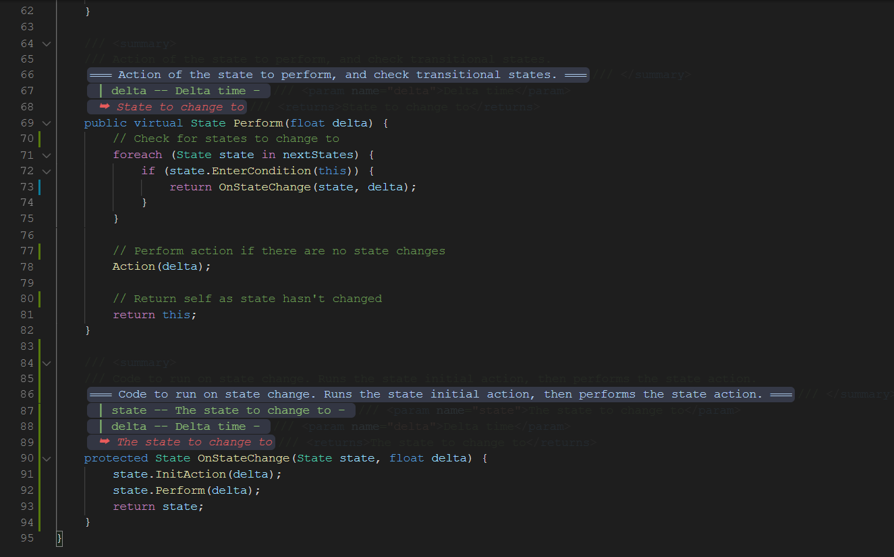

# C# Prettier Docs

A Visual Studio Code extension that makes your C# XML docs look just a tad bit nicer.

## Features

- Use the Toggle command to quickly enable/disable the extension.
- Edit the look and feel of the docs through various settings.

### 1.0.0

Initial Release

### 1.1.0

- Doc being edited temporarily disables pretty docs for ease of editing
- Empty parameters does not show delimiters

---

_Special thanks to [robertgr991](https://github.com/robertgr991), whose [php-parameter-hint](https://github.com/robertgr991/php-parameter-hint) source code was very helpful as a reference when I was learning the VS Code Extensions API._
